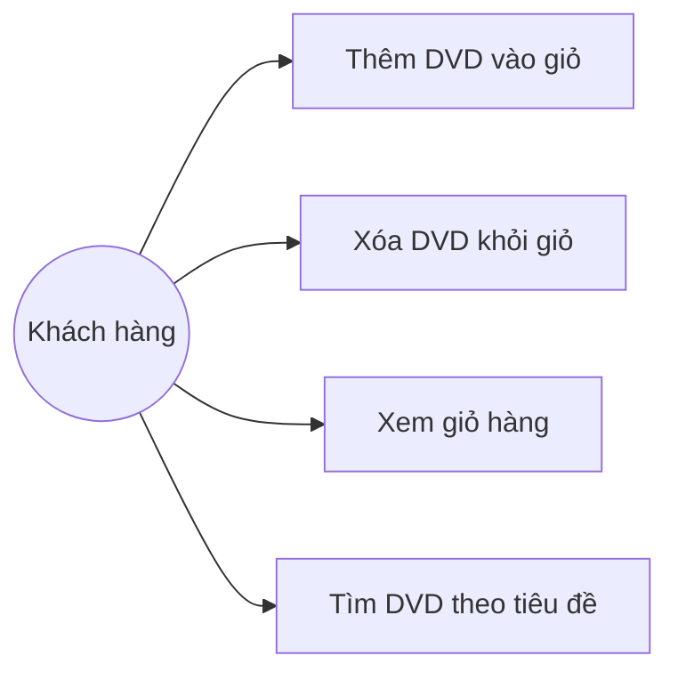

# Sơ đồ use case – AIMS-mini

```mermaid
flowchart LR
    C((Khách hàng))
    C --> UC1[Thêm DVD vào giỏ]
    C --> UC2[Xóa DVD khỏi giỏ]
    C --> UC3[Xem giỏ hàng]
    C --> UC4[Tìm DVD theo tiêu đề]
```